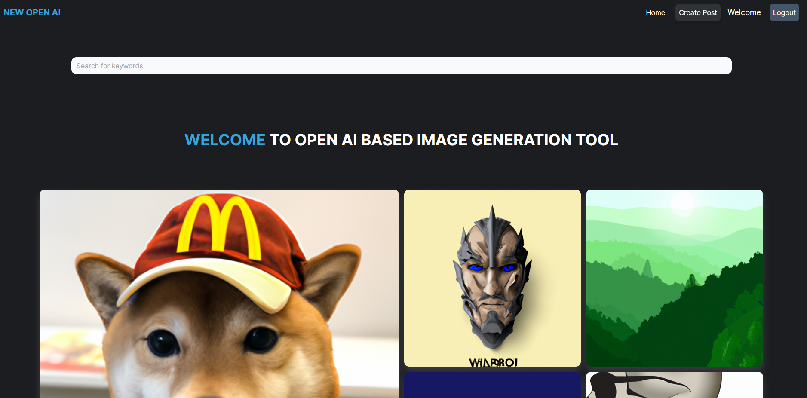

# AI Image Generation 



## Based on API provided by OpenAI 
This project is an AI-powered image generation application built using the MERN stack (MongoDB, Express.js, React.js, Node.js), Tailwind CSS, OpenAI API, and Cloudinary. It allows users to generate realistic images based on their inputs and showcase them in the community.

## Features

- User-friendly interface for generating AI-generated images
- Integration with OpenAI API for image generation
- Image storage and management using Cloudinary
- MongoDB database for storing user information and generated images
- Community page to showcase your work
- Responsive design powered by Tailwind CSS

## Installation

Follow the instructions below to set up and run the project on your local machine:

1. Clone the repository:
```
    git clone https://github.com/nishaaannnt/openai-image-website
```

2. Navigate to the project directory:
```
cd ai-image-generation
```

3. Install the dependencies for the backend:
```
cd server
npm install
```

4. Configure the environment variables:

- Create a `.env` file in the `server` directory.
- Set up the necessary environment variables in the `.env` file. For example:

  ```
  PORT=5000
  DATABASE_URL=<your-mongodb-url>
  OPENAI_API_KEY=<your-openai-api-key>
  CLOUDINARY_CLOUD_NAME=<your-cloudinary-cloud-name>
  CLOUDINARY_API_KEY=<your-cloudinary-api-key>
  CLOUDINARY_API_SECRET=<your-cloudinary-api-secret>
  ```
- You can obtain the API keys by heading to their respective websites
5. Install the dependencies for the frontend:
```
cd ../client
npm install
```

6. Build the frontend assets:
```
npm run build
```

7. Start the server:
```
cd ../server
npm start
```

8. Access the application on `http://localhost:5000` in your browser.

## Note 

API used in the application is mine personal so if you cannot generate an image there is a possibility that API requests have reached their limit